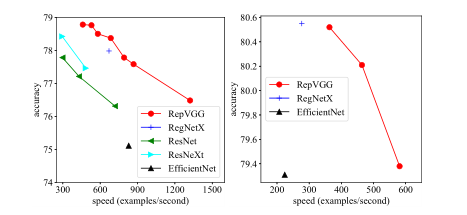

# RepVGG_Tutorial

论文链接：https://arxiv.org/abs/2101.03697

Github_pytorch：https://github.com/DingXiaoH/RepVGG

论文解读：

paddlepaddle代码深入讲解：https://aistudio.baidu.com/aistudio/projectdetail/1664955?shared=1

Pytorch代码深入讲解：以后逐渐补充，paddle框架和torch差不多不妨碍理解

