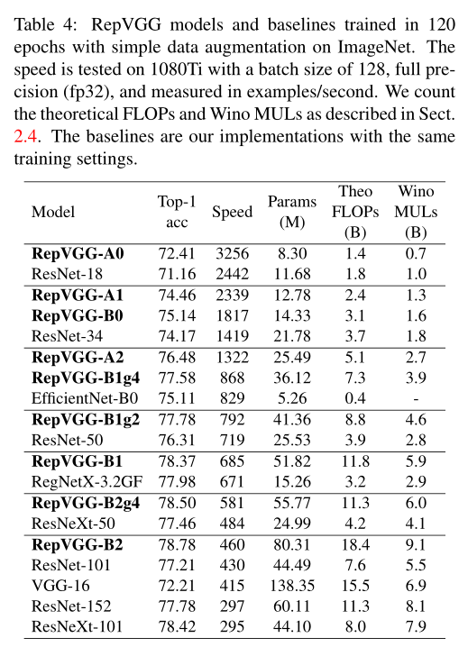

# RepVGG

### 摘要

本文提出了简单而又强大的卷积神经网络结构，推理阶段仅由 3x3 卷积和ReLU组成的VGG风格结构，训练阶段则具有多分支结构，这种训练-推理的解耦是一种叫做“重参数化(re-paramenterization)”的技术实现，因此该网络被称为RepVGG

### 引言

越复杂的网络比如ResNet，DenseNet，ResNeXt等尽管精度很高，但是缺点很明显：

- 复杂的分支设计，降低了推理速度并且增加了内存占用
- 一些组件（如DW，通道混洗等），增加了MAC(内存访问成本)并且缺乏硬件适用

尽管上面这些有利于训练并提高精度，但是会影响推理的速度。

因此作者提出了RepVGG，优点如下：

- 拥有VGG类似的直筒式结构
- 仅用 3x3 卷积和ReLU
- 没有自动搜索，复合缩放等繁重设计

多分支结构利于训练，可以避免梯度爆炸梯度消失，但是不适合推理，本文就是训练阶段用分支结构，推理时候讲训练阶段的参数合并成VGG风格的单路结构

### 相关工作

##### 从单路到多分支

自从VGG之后出现很多优秀的模型，越来越复杂的模型比如基于NAS的模型虽然有很高的精度，但是结构复杂难以在常规GPU训练，从而限制了应用，其次复杂的模型可能降低计算并行度，从而减慢推理速度

##### 单路径模型的有效训练

提升单路模型的精度工作很多，但很少有令人眼前一亮的，本文目标是利用常见的组件和简单的代数运算来构建一个简单的模型，其具有合适的深度以及在速度和精度取得tradeoff

##### 模型重参数化

DiracNet是一个重参数化模型，不过RepVGG中的结构重参数化有不同：

- RepVGG的结构再参数化技术是通过一个具体结构的数据流来实现的，该结构后续被转换成另一个结构，而DiracNet仅使用卷积核的另一个数学表达来简化优化操作
- DiracNet的性能低于ResNet，而RepVGG性能高于ResNet

##### Winograd 卷积

3x3卷积是在被CuDNN等计算库优化过的，Winograd卷积是一种加速卷积计算效率的算法，可将3*3的乘法次数（MULs）减少为原来的4/9。可见硬件对3x3卷积有着天然的支持。

### 利用结构重参数化构造RepVGG

##### 简单就是快速高效灵活

简单的conv有三优势

- 推理快：VGG参数多，但是推理速度比efficientnet快很多，后者参数量要比VGG小的多，这说明FLOPs不能唯一决定推理速度
- 内存高效：多分支占内存，分支越多内存越高

- 灵活：多分支结构受约束比如resnet，要求两个分支具有相同shape，否则shortcut没有意义，同时多分支对通道剪枝也不友好

##### 训练阶段多分支结构

多分支结构对训练很友好，比如resnet，densenet，可以达到高精度，但是对inference并不友好，而plain结构（VGG16等）推理阶段很快，但是训练精度并不高，作者受到启发，设计了一个shortcut分支结构 out = 1x1 conv_bn+ 3x3 conv_bn+ identity，利用多分支结构训练优势，推理时候变成 out = 3x3 conv ,利用plain结构推理优势

##### 推理阶段重参数化

1x1卷积核参数加到3x3卷积核中心部分就行，identity部分取对角线核参数加入3x3卷积核中心部分，如上图所示

##### 网络规格

- a、b是缩放系数
- 第一个stage处理大分辨率，只设计一个3x3卷积而减小参数量
- 最后一层channel很多，只设计一个3x3卷积而减小参数量
- 按照ResNet，更多层放到倒数第二个stage
- 为了实现下采样，每个stage第一个3x3卷积将stride设置2
- 不同规模RepVGG如下图所示

### 实验结果

